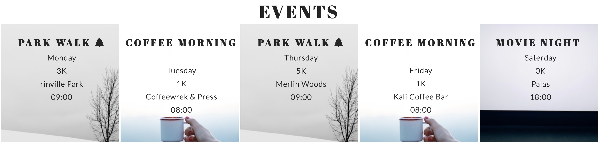
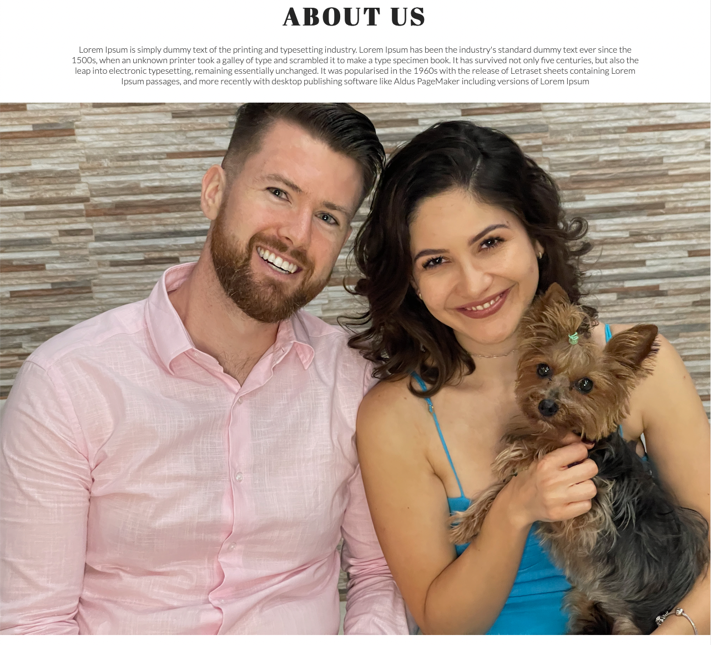
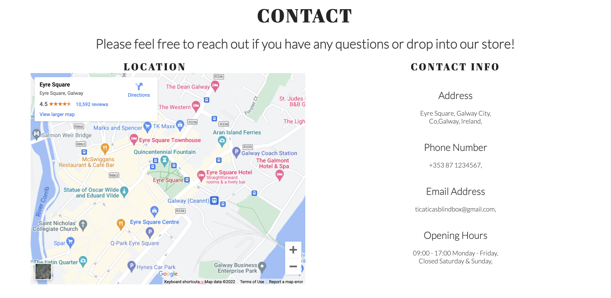
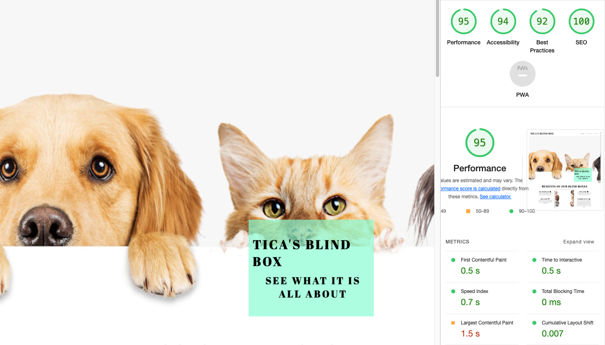
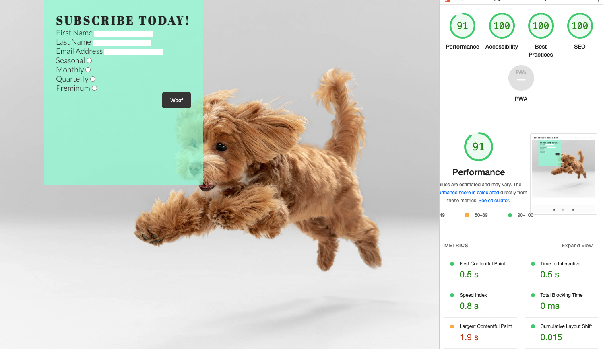
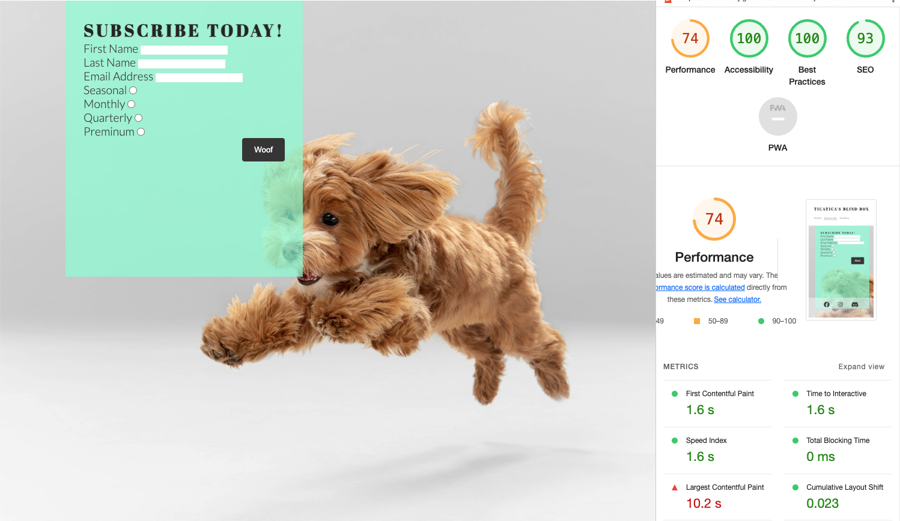
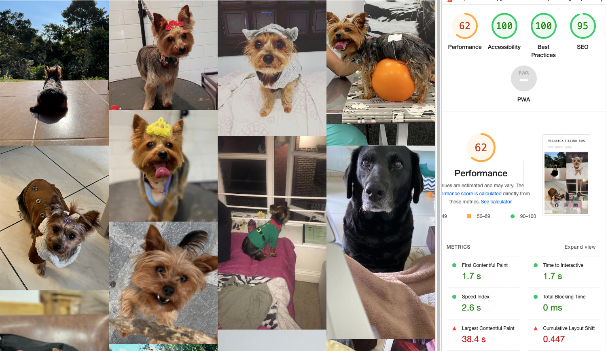

# Tica Tica's Blind Box

## Features

### Existing Features

**Navigation Bar**

**The landing page image section**

**Benefits Section**

**Packages Section**

**Events Section**

**About Us**

**Location & Contact Section**

**The Footer**

**Submission Form**

**Gallery**

### Features Left to Implement

## Testing

### Validator Testing
* HTML
    * No errors were found when passing the site pages through the [official W3C validator](https://validator.w3.org/)

* CSS
    * No errors were found when passing the site pages through the [official (Jigsaw) validator](https://jigsaw.w3.org/css-validator/)

* Accessibility
    * No errors or contrast were found when passing the site pages through the [official wave.webaim validator](https://wave.webaim.org/)

* Performance
    

    

    

    

    

    

### Unfixed Bugs

## Deployment

## Credits

### Content

### Media

