# Tica Tica's Blind Box
(Developer: Christopher Faherty)

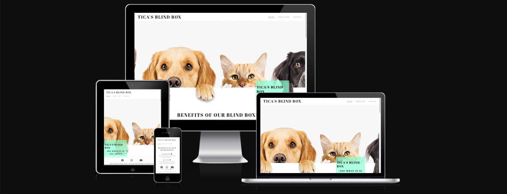

[Live Webpage](https://chrisfaherty.github.io/CI_PP1_TBB/)

## Table of Content

1. [Project Goals](#project-goals)
    1. [User Goals](#user-goals)
    2. [Site Owner Goals](#site-owner-goals)
2. [User Experience](#user-experience)
    1. [Target Audience](#target-audience)
    2. [User Requrements and Expectations](#user-requrements-and-expectations)
    3. [User Stories](#user-stories)
3. [Design](#design)
    1. [Design Choices](#design-choices)
    2. [Colour](#colours)
    3. [Fonts](#fonts)
    4. [Structure](#structure)
    5. [Wireframes](#wireframes)
4. [Technologies Used](#technologies-used)
    1. [Languages](#languages)
    2. [Frameworks & Tools](#frameworks-&-tools)
5. [Features](#features)
6. [Testing](#testing)
    1. [HTML Validation](#HTML-validation)
    2. [CSS Validation](#CSS-validation)
    3. [Accessibility](#accessibility)
    4. [Performance](#performance)
    5. [Device testing](#performing-tests-on-various-devices)
    6. [Browser compatibility](#browser-compatability)
    7. [Testing user stories](#testing-user-stories)
8. [Bugs](#Bugs)
9. [Deployment](#deployment)
10. [Credits](#credits)
11. [Acknowledgements](#acknowledgements)

## Project Goals

### User Goals
* Finding a subscription service that that offers a selection of pet blind boxes.
* Have well detailed package options.
* Have a vibrant community.
* Have contact and location information.

### Site Owner Goals
* Increase the number of monthly subscribers.
* Get more eyes on the product.
* Provide an easy path for new customers to join the community.
* Provide all the essencial information the customer requires to make a decission.

## User Experiance

### Target Audience
* People with pets.
* People that like keep their pets up to fashion.
* People looking to get to know other pet owners in their area.
* People looking to join a community of like minded people.

### User Requirements and Expectations
* A intuative navigation bar.
* All relevent information can be found with out an issue.
* All links and functions work as expected.
* Straight forward way to get in contact with the business.
* Products clearly layed out with pricing.
* A site that is Accessability focused.

Tica tica's blind box is a website for all pet lovers. The website highlights out main product which is blind box' full of exciting suprizes to put a smile on your pets face again and again. 

The users that view this site will find all the relevent information about the product community how to sign up and also enjoy a gallery of images sent from our customers. The target demagraphic of this site are pet owners that are looking to spice up their pet's day.

## Features

There are various different fetures in this project over the main home page with several sections to the gallery and submission's page. Lets dive a bit deeper into each feature in this section. The colour scheme of this project is black and white to keep it looking clean and the accent colours are aquamarine.

### Existing Features

* Navigation Bar
    * The navigation bar is situated at the top of the page. It has a link in the Tica's Blind Box title to return the user back to  the top of the home page no matter what page they are on. This logo link is positioned to the left of the header,
    * The navigation links to the home page, submission form & gallery are all positioned to the right hand side of the header,
    * The black text in the navigation bar links contrasts nicely with the white background and main hero image below,
    * This Navigation bar is clear to tell the website you are on and intuative to use navigation between each page,
    * The navigation bar colapses when viewed on movile where the 3 links Home, Subscribe & Gallery fit below the logo.

* The landing Page
    * The landing page shows the name of the site in a floating box positioned above the main image. The box stands outr with a transparent aquamarine background,
    * The text box also has a lead on sentance to get the reader to continue down the page,
    * On mobile devices the background image will disapear and only show the text box,
    * This section is used to intrigue the user to want to continue on and see what else in in the website.

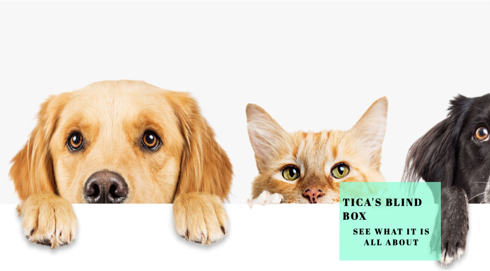

* Benefits
    * This section is used to remind the user of benefits they and their pet would enjoy.
    * It highlights the main aspects this project looks to achieve happiness, good health, stylish pet and a supportive & interactive community,
    * This section also has a fun center image that brings everything together, 
    * The benefits section is set up for mobile as well and will stack ontop of eachother if it is viewed on a mobile device.

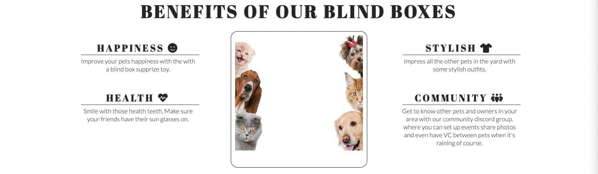

* Packages
    * The packages section covers the four types of blind boxes we offer our users,
    * The packages include a description of the contents that are insice each blind box and the monthly subscription cost for each,
    * This section is set up to tier over eachother for tablet and and mobile screens.

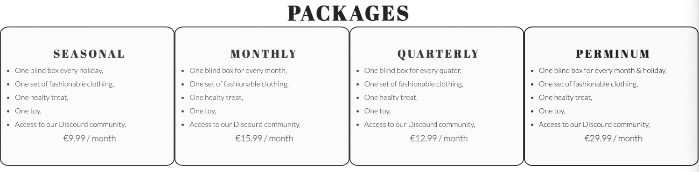

* Events
    * This section shows the different events that are available to the communit, 
    * The events have background images that have good contrast with the black text,
    * The events also scale for tablet and mobile devices,
    * Font awesome symboles were added to the heading of the Park walk event.

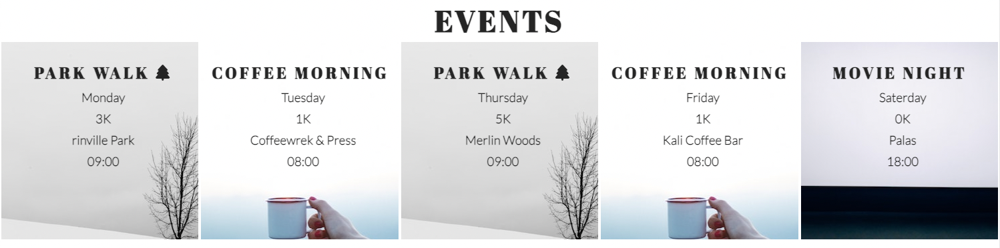

* About Us
    * This section covers who the owners are and the reason behind startign this companey,
    * There is also a responsive image added to scale with the screen size.

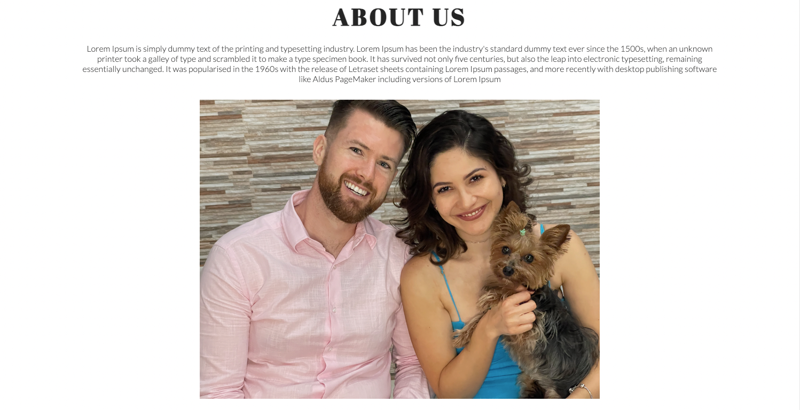

* Location & Contact Section
    * There is two columns here one for the location anf one for contact information. 
    * For the location a google maps iframe was imbeded into the page with the exact location,
    * The contact section covers our address, phone number, email & opening hours,
    * Both columns are responsive to changing screen sizes.

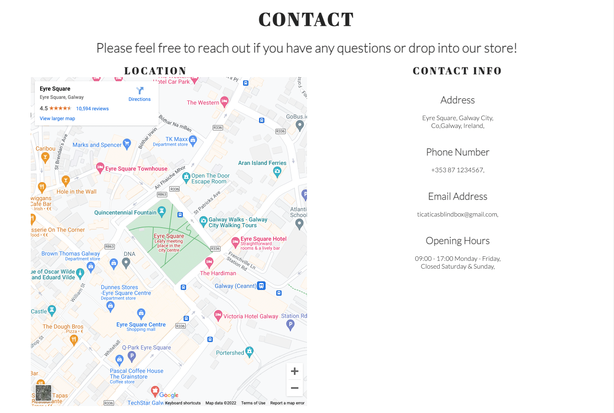

* The Footer 
    * The footer section keeps the social media links static at the bottom of the page, 
    * The facebook, Instagram & discord links open up a new webpace when they are clicked on,
    * The icons were sourced and imported from font awosome, 
    * To make the footer responsive for both mobile and desktop screens. It will stay th the bottom of your screen on mobile so you always have access to the links. 

* Subscription Form
    * The subscription form gathers the users data and what package they are intrested in,
    * The styling alines with the home page where there is a background image and a aquamarine floating box,
    * The form requires the name, email and a package to be selected.
    * The form wont submit if all of the above are not chosen and the email address has to be a correct email.

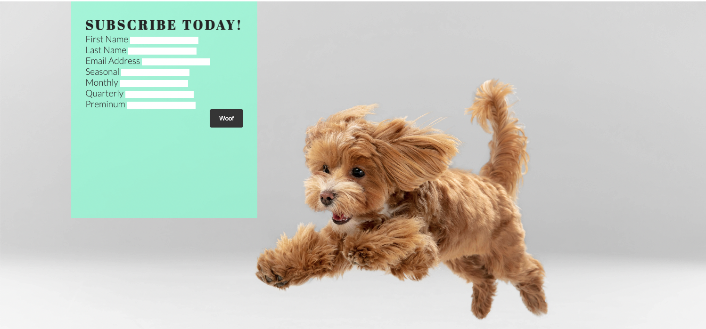

* Gallery
    * The gallery is used to provide the used with images from events or images that are placed into our Discord community channel,
    * These images can change with time as members request to have their pet added,
    * It is also used to promote the product as you will see pets with clothing in the images,
    * The images scale with the screen size as well.

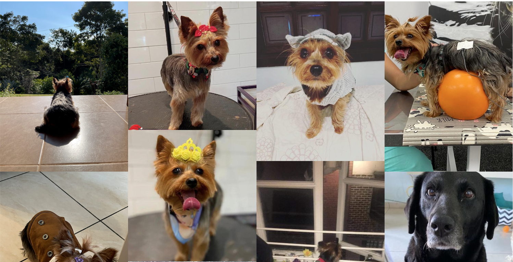

### Features Left to Implement
    * A feature that I would like to implement in the future is to check out on the sight when you sign up for a subscription,

## Testing

* The site works on google Chrome, Safari & Firefox,
* The three webpages were tested to be responsive as a desktop, tablet and mobile screensize,
* All images and text was reviewed and confirmed to be readable,
* The Form works as it requires the user to input a name, email & select a package before it can be submitted.

### Bugs
**Solved Bugs**
* When working with the footer on the home pace in mobile the fotter would move up behind the contacts and location section.
    * This was resolved by fixing the footers position to the bottom of the page and giving it a transparent background so that it could stay at the bottom of the screen and move with the page. 

### Validator Testing
* HTML
    * No errors were found when passing the site pages through the [official W3C validator](https://validator.w3.org/)

    

Home

    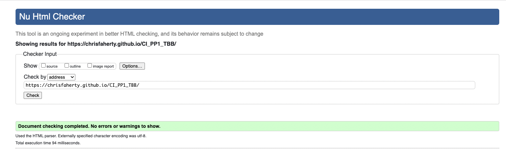
    

    

Subscribe

    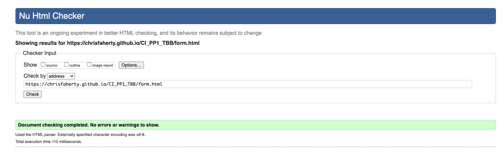
    

    

Gallery

    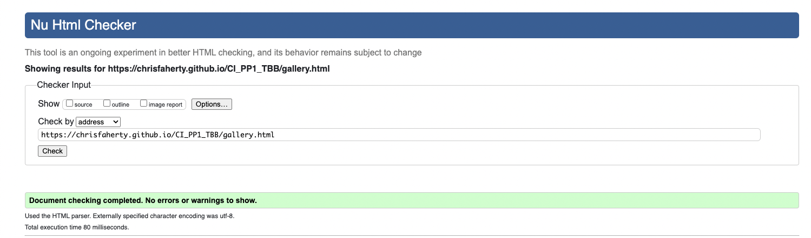
    

* CSS
    * No errors were found when passing the site pages through the [official (Jigsaw) validator](https://jigsaw.w3.org/css-validator/)
    

Image

    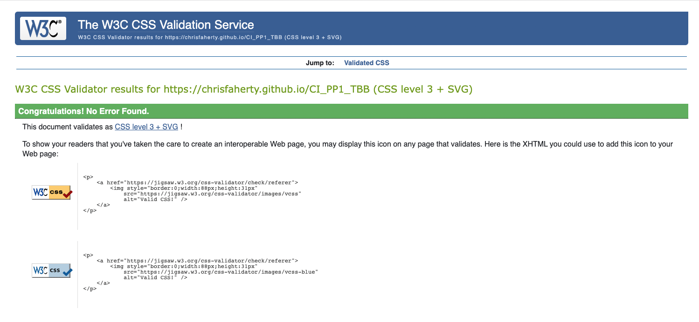
    

* Accessibility
    * No errors or contrast were found when passing the site pages through the [official wave.webaim validator](https://wave.webaim.org/)

    

Home

    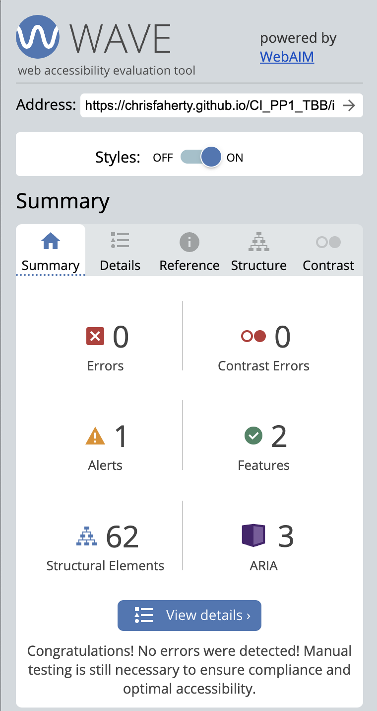
    

    

Subscribe

    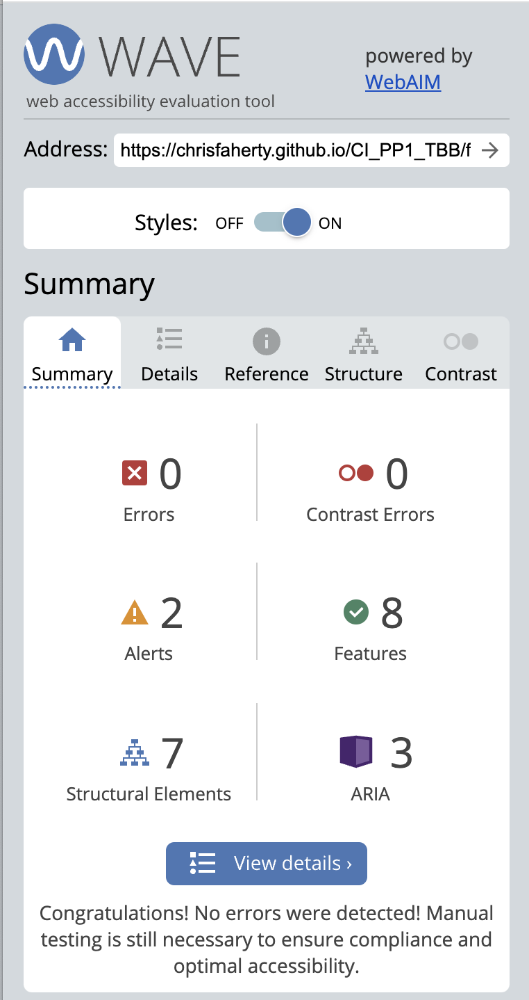
    

    

Gallery

    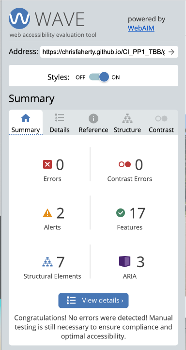
    

* Performance
    * The performance was tested in lighthouse on the chrome browser on all pages.

    

Home

    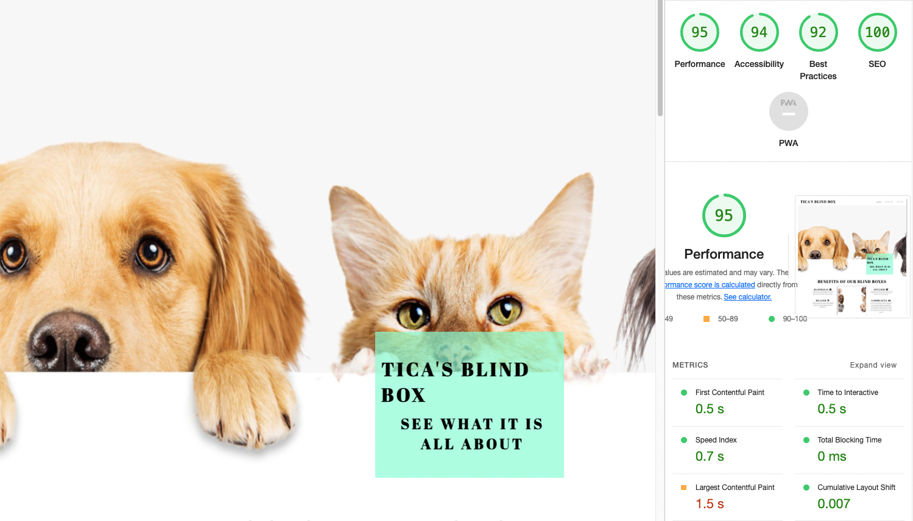
    

    

Subscribe

    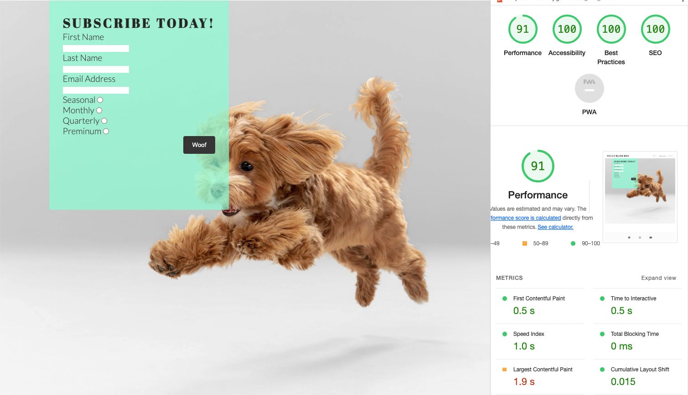
    

    

Gallery

    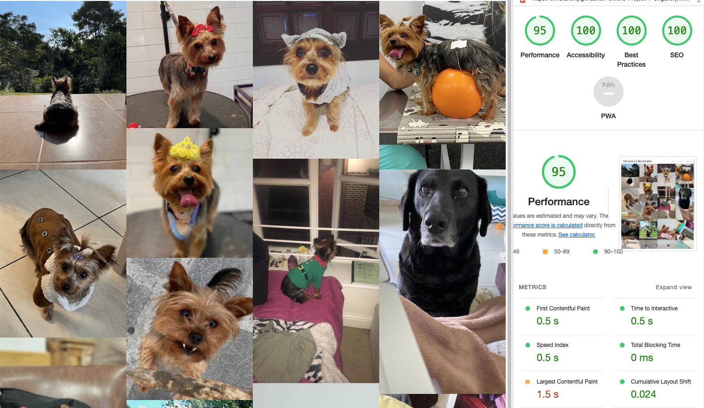
    

### Unfixed Bugs
* There is no unfixed bugs that I am aware of.

## Deployment
* Tica's blind box site was deployed to GitHub page,
* All of the commits and repositry info can be found on GitHub,

* The process to deploy a site to GitHub pages is as follows:
    * Navigate to the settings tab at the top of the page in the navigation bar,
    * Select pages on the left hand side of the settings nav bar,
    * Once in pages the dropdown menu under branch select Main,
    * Then click save and your URL will be generated shortly,
    * Inorder to keep your deployed site up to date make sure to push your commits to GitHub.

## Credits
* Insperation was taken from the love running project with certain aspects of code. It is also commented in the code.
* W3Schools was also used for specific parts of the code.

### Content

### Media

