# Tica Tica's Blind Box
(Developer: Christopher Faherty)

[Live Webpage](https://chrisfaherty.github.io/CI_PP1_TBB/)

## Table of Content

1. [Project Goals](#project-goals)
    1. [User Goals](#user-goals)
    2. [Return User Goals](#returning-user)
    3. [Site Owner Goals](#site-owner-goals)
2. [User Experience](#user-experience)
    1. [Target Audience](#target-audience)
    2. [User Requirements and Expectations](#user-requirements-and-expectations)
    3. [User Stories](#user-stories)
3. [Design](#design)
    1. [Design Choices](#design-choices)
    2. [Colour](#colour)
    3. [Fonts](#fonts)
    4. [Structure](#structure)
    5. [Wireframes](#wireframes)
4. [Technologies Used](#technologies-used)
    1. [Languages](#languages)
    2. [Framework and Tools](#framework-and-tools)
5. [Features](#features)
6. [Testing](#testing)
    1. [Testing user stories](#testing-user-stories)
8. [Bugs](#bugs)
9. [Deployment](#deployment)
10. [Credits](#credits)
11. [Acknowledgements](#acknowledgements)

## Project Goals

### User Goals
* Finding a subscription service that that offers a selection of pet blind boxes.
* Have well detailed package options.
* Have a vibrant community.
* Have contact and location information.

### Site Owner Goals
* Increase the number of monthly subscribers.
* Get more eyes on the product.
* Provide an easy path for new customers to join the community.
* Provide all the essencial information the customer requires to make a decission.

## User Experience

### Target Audience
* People with pets.
* People that like keep their pets up to fashion.
* People looking to get to know other pet owners in their area.
* People looking to join a community of like minded people.

### User Requirements and Expectations
* A intuative navigation bar.
* All relevent information can be found with out an issue.
* All links and functions work as expected.
* Straight forward way to get in contact with the business.
* Products clearly layed out with pricing.
* A site that is Accessability focused.

### User Stories

#### First-time  User
1. As a first time user, I want to know what subscription packages are available.
2. As a first time user, I want to know the package price range.
3. As a first time user, I want to know the contact information.
4. As a first time user, I want to know where the office is located.
5. As a first time user, I want to be able to show my intrest in one of the packages and subscribe to hear more.

#### Returning User
6. As a returning user, I want to know what the upcomming events are. 
7. As a returning user, I want to be able to access the social media links.
8. As a returning user, I want to know the opening times.
9. As a returning user , I want to be able to contact the the team.
10. As a returning user, I want to be able to see the updated photos in the gallery.

#### Site Owner
11. As the site owner, I want users to keep up to date with package changes.
12. As the site owner, I want users to be able to see the weekly events.
13. As the site owner, I want users to be able to subscribe to the package they want.
14. As the site owner, I want users to be able to contact us.

## Design

### Design Choices
The site was designed to have a minimal look and highlight all the relevent components. The images look like they are floating with the colour and image choices that were used.

### Colour
The colour scheme used in this project was white backgounds with black text. This went alogn with the suttle light gray highlights and aqua marine accent colour then a pop was required.

### Fonts
The fonts that were chosen were Lato for the logo and Abril Fatface for the content. Both of these fonts had a fall back of sans-serif.

### Structure
The home page is structured is an intuative way where all the relevent information is presented at the correct time. 
* The benifets section tells you what you the intangible benifits from the product.
* The packages gives a varity of entry options to the community.
* The events then highlight the community aspect.
* The gallery shows images of pets that have already signed up.
* Then there is a subscription page to get in touch.

### Wireframes

Home

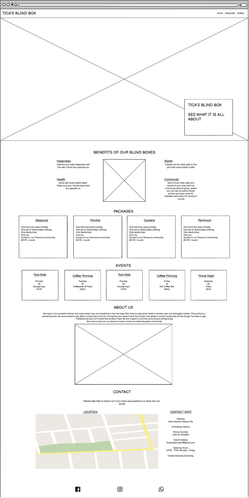
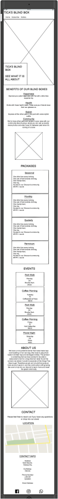
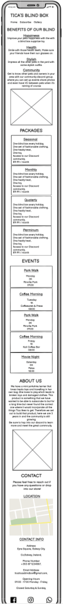

Subscription

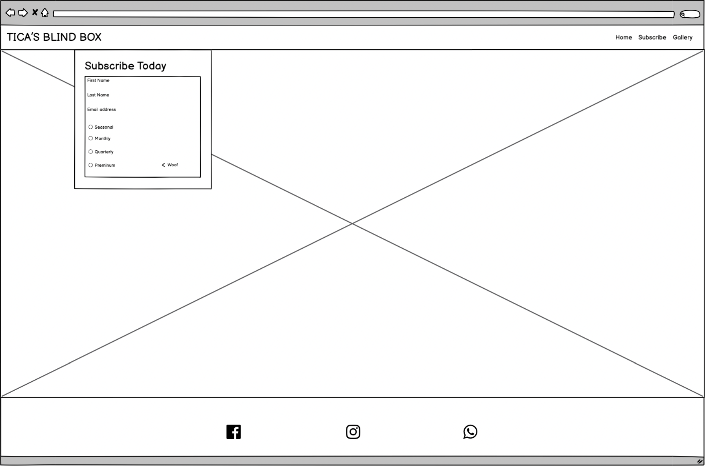
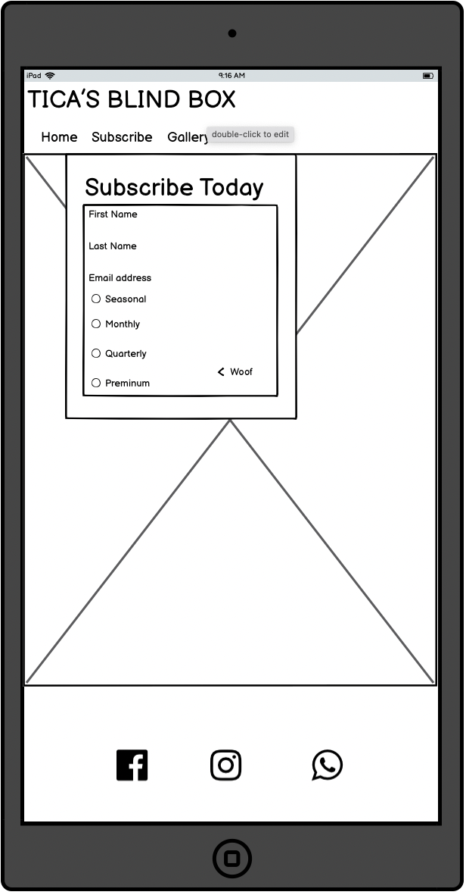
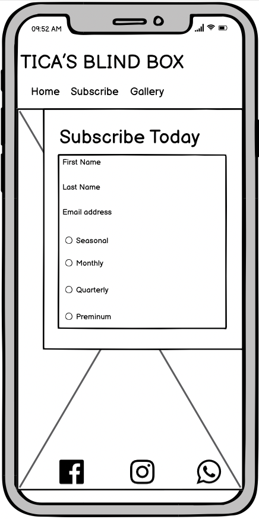

Gallery

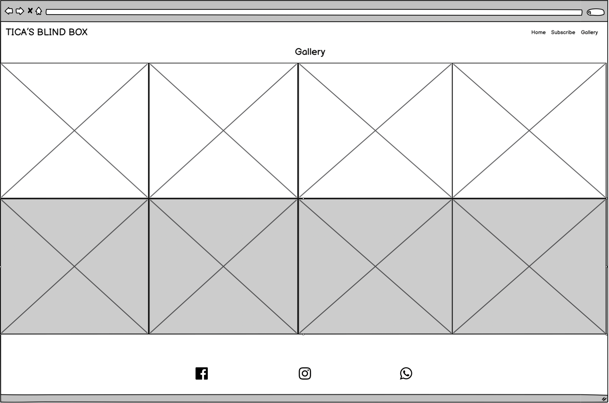
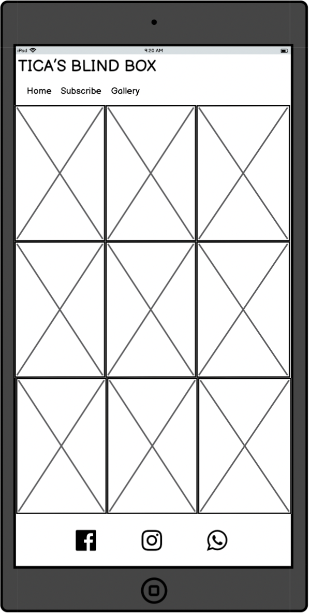
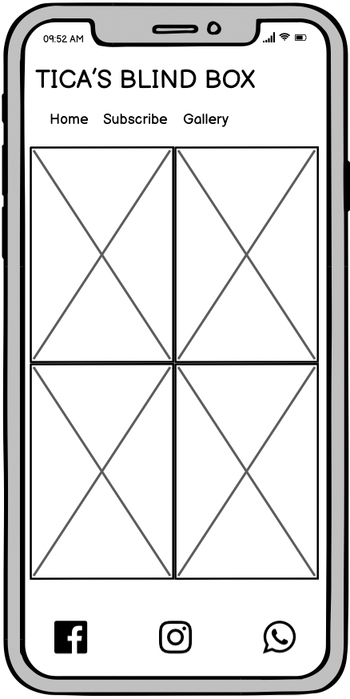

## Technologies Used

### Languages
* HTML
* CSS

### Framework and Tools
* Git
* GitHub
* Gitpod
* Tinypng
* Favicon.io
* Font Awosome
* Google Fonts
* Balsamiq

## Features

There are various different fetures in this project over the main home page with several sections to the gallery and submission's page. Lets dive a bit deeper into each feature in this section. The colour scheme of this project is black and white to keep it looking clean and the accent colours are aquamarine.

### Existing Features

* Navigation Bar
    * The navigation bar is situated at the top of the page. It has a link in the Tica's Blind Box title to return the user back to  the top of the home page no matter what page they are on. This logo link is positioned to the left of the header,
    * The navigation links to the home page, submission form & gallery are all positioned to the right hand side of the header,
    * The black text in the navigation bar links contrasts nicely with the white background and main hero image below,
    * This Navigation bar is clear to tell the website you are on and intuative to use navigation between each page,
    * The navigation bar colapses when viewed on movile where the 3 links Home, Subscribe & Gallery fit below the logo.

* The landing Page
    * The landing page shows the name of the site in a floating box positioned above the main image. The box stands outr with a transparent aquamarine background,
    * The text box also has a lead on sentance to get the reader to continue down the page,
    * On mobile devices the background image will disapear and only show the text box,
    * This section is used to intrigue the user to want to continue on and see what else in in the website.

* Benefits
    * This section is used to remind the user of benefits they and their pet would enjoy.
    * It highlights the main aspects this project looks to achieve happiness, good health, stylish pet and a supportive & interactive community,
    * This section also has a fun center image that brings everything together, 
    * The benefits section is set up for mobile as well and will stack ontop of eachother if it is viewed on a mobile device.

* Packages
    * The packages section covers the four types of blind boxes we offer our users,
    * The packages include a description of the contents that are insice each blind box and the monthly subscription cost for each,
    * This section is set up to tier over eachother for tablet and and mobile screens.
    * User stories covered 1, 2 & 11.

* Events
    * This section shows the different events that are available to the communit, 
    * The events have background images that have good contrast with the black text,
    * The events also scale for tablet and mobile devices,
    * Font awesome symboles were added to the heading of the Park walk event.
    * User stories covered 6 & 12.

* About Us
    * This section covers who the owners are and the reason behind startign this companey,
    * There is also a responsive image added to scale with the screen size.

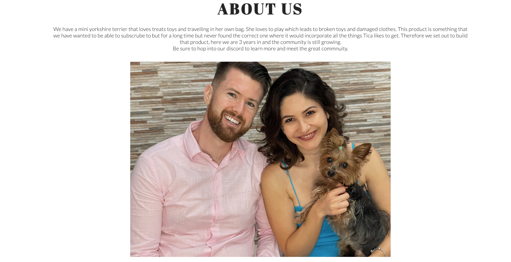

* Location & Contact Section
    * There is two columns here one for the location anf one for contact information. 
    * For the location a google maps iframe was imbeded into the page with the exact location,
    * The contact section covers our address, phone number, email & opening hours,
    * Both columns are responsive to changing screen sizes.
    * User stories covered 3, 4, 8 & 9

* The Footer 
    * The footer section keeps the social media links static at the bottom of the page, 
    * The facebook, Instagram & discord links open up a new webpace when they are clicked on,
    * The icons were sourced and imported from font awosome, 
    * To make the footer responsive for both mobile and desktop screens. It will stay th the bottom of your screen on mobile so you always have access to the links.
    * User stories covered 7 & 14.

* Subscription Form
    * The subscription form gathers the users data and what package they are intrested in,
    * The styling alines with the home page where there is a background image and a aquamarine floating box,
    * The form requires the name, email and a package to be selected.
    * The form wont submit if all of the above are not chosen and the email address has to be a correct email.
    * User stories covered 5 & 13.

* Gallery
    * The gallery is used to provide the used with images from events or images that are placed into our Discord community channel,
    * These images can change with time as members request to have their pet added,
    * It is also used to promote the product as you will see pets with clothing in the images,
    * The images scale with the screen size as well.
    * User stories covered 10.

### Features Left to Implement
* A feature that I would like to implement in the future is to check out on the sight when you sign up for a subscription,

## Testing

* The site works on the following browsers
    * Google Chrome.
    * Safari.
    * Firefox.
* The three webpages were tested to be responsive as a desktop, tablet and mobile screensize,
* All images and text was reviewed and confirmed to be readable,
* The Form works as it requires the user to input a name, email & select a package before it can be submitted.

### Bugs
**Solved Bugs**
* When working with the footer on the home pace in mobile the footer would move up behind the contacts and location section.
    * This was resolved by fixing the footers position to the bottom of the page and giving it a transparent background so that it could stay at the bottom of the screen and move with the page. 

### Validator Testing
* HTML
    * No errors were found when passing the site pages through the [official W3C validator](https://validator.w3.org/)

    

Home

    
    

    

Subscribe

    
    

    

Gallery

    
    

* CSS
    * No errors were found when passing the site pages through the [official (Jigsaw) validator](https://jigsaw.w3.org/css-validator/)
    

Image

    
    

* Accessibility
    * No errors or contrast were found when passing the site pages through the [official wave.webaim validator](https://wave.webaim.org/)

    

Home

    
    

    

Subscribe

    
    

    

Gallery

    
    

* Performance
    * The performance was tested in lighthouse on the chrome browser on all pages.

    

Home

    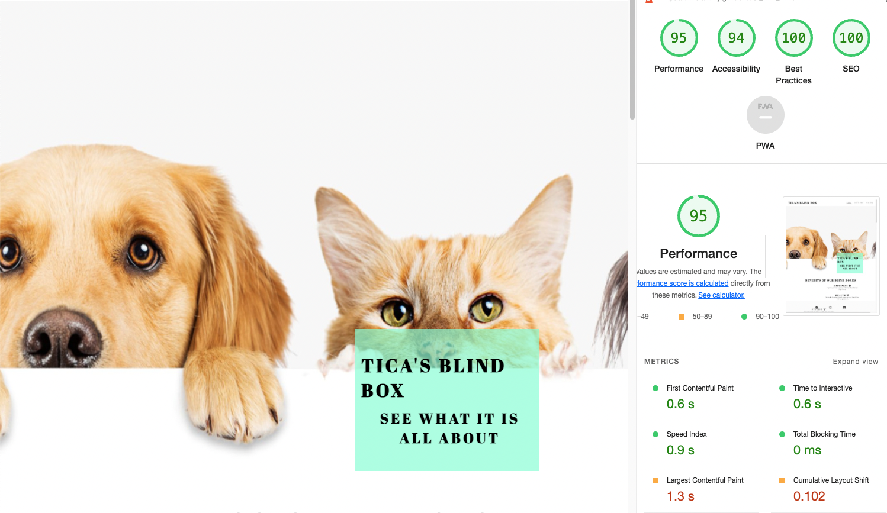
    

    

Subscribe

    
    

    

Gallery

    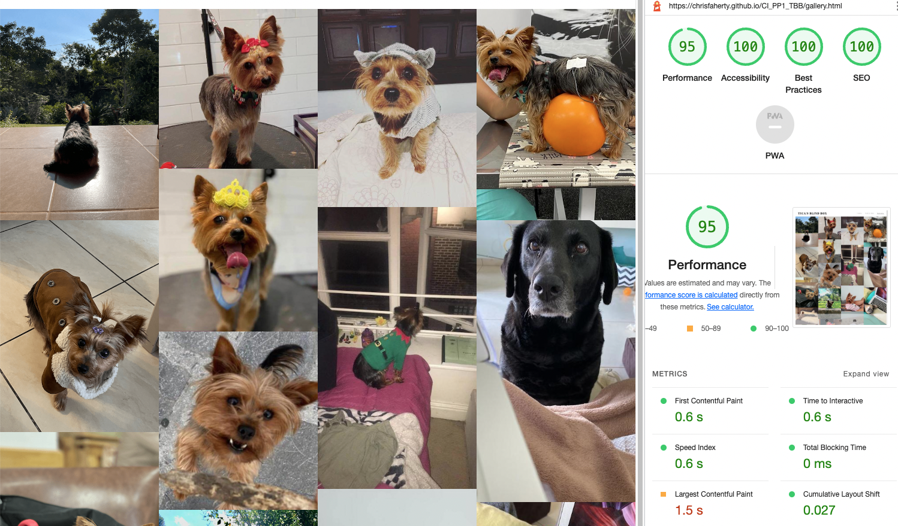
    

### Testing user stories
1. As a first time user, I want to know what subscription packages are available.

| **Feature** | **Action** | **Expected Results** | **Actual Result** |
|-------------|------------|----------------------|-------------------|
| Packages | Scroll down to the packages section | Locating the four different packages | Works as expected |

Screenshots

2. As a first time user, I want to know the package price range.

| **Feature** | **Action** | **Expected Results** | **Actual Result** |
|-------------|------------|----------------------|-------------------|
| Packages | Scroll down to the packages section | Locating the four different packages prices | Works as expected |

Screenshots

3. As a first time user, I want to know the contact information.

| **Feature** | **Action** | **Expected Results** | **Actual Result** |
|-------------|------------|----------------------|-------------------|
| Contact | Scroll down to the contact section | Locating the contact information | Works as expected |

Screenshots

4. As a first time user, I want to know where the office is located.

| **Feature** | **Action** | **Expected Results** | **Actual Result** |
|-------------|------------|----------------------|-------------------|
| Location | Scroll down to the location section | Locating the loaction information | Works as expected |

Screenshots

5. As a first time user, I want to be able to show my intrest in one of the packages and subscribe to hear more.

| **Feature** | **Action** | **Expected Results** | **Actual Result** |
|-------------|------------|----------------------|-------------------|
| Subscription | In the navigation bar select the subscribe link, Then you can fill out thr form to subscribe | Locating the subscription form | Works as expected |

Screenshots

6. As a returning user, I want to know what the upcomming events are.

| **Feature** | **Action** | **Expected Results** | **Actual Result** |
|-------------|------------|----------------------|-------------------|
| Events | Scroll down to the events section | Locating the weekly events | Works as expected |

Screenshots

7. As a returning user, I want to be able to access the social media links.

| **Feature** | **Action** | **Expected Results** | **Actual Result** |
|-------------|------------|----------------------|-------------------|
| Social Media | Scroll down to the footer section and select the link to the social platform | Locating the three different social links | Works as expected|

Screenshots

8. As a returning user, I want to know the opening times.

| **Feature** | **Action** | **Expected Results** | **Actual Result** |
|-------------|------------|----------------------|-------------------|
| Opening Times | Scroll down to the contact section | Locating the opening times | Works as expected|

Screenshots

9. As a returning user , I want to be able to contact the the team.

| **Feature** | **Action** | **Expected Results** | **Actual Result** |
|-------------|------------|----------------------|-------------------|
| Contact | Scroll down to the contact section | Locating the phone number and email address | Works as expected|

Screenshots

10. As a returning user, I want to be able to see the updated photos in the gallery.

| **Feature** | **Action** | **Expected Results** | **Actual Result** |
|-------------|------------|----------------------|-------------------|
| Gallery | Select the gallery link in the navigation bar, then navigate to the gallery page | Locating the gallery images | Works as expected|

Screenshots

11. As the site owner, I want users to keep up to date with package changes.

| **Feature** | **Action** | **Expected Results** | **Actual Result** |
|-------------|------------|----------------------|-------------------|
| Packages | Scroll down to the packages section | Locating the four different packages | Works as expected|

Screenshots

12. As the site owner, I want users to be able to see the weekly events.

| **Feature** | **Action** | **Expected Results** | **Actual Result** |
|-------------|------------|----------------------|-------------------|
| Events | Scroll down to the events section | Locating the different weekly events | Works as expected|

Screenshots

13. As the site owner, I want users to be able to subscribe to the package they want.

| **Feature** | **Action** | **Expected Results** | **Actual Result** |
|-------------|------------|----------------------|-------------------|
| Subscription | In the navigation bar select the subscribe link, Then you can fill out thr form to subscribe | Locating the subscription form | Works as expected|

Screenshots

14. As the site owner, I want users to be able to contact us.

| **Feature** | **Action** | **Expected Results** | **Actual Result** |
|-------------|------------|----------------------|-------------------|
| Contact | Scroll down to the contact section | Locating the contact number and email address | Works as expected|

Screenshots

### Unfixed Bugs
* There is no unfixed bugs.

## Deployment
* Tica's blind box site was deployed to GitHub page,
* All of the commits and repositry info can be found on GitHub,

* The process to deploy a site to GitHub pages is as follows:
    * Navigate to the settings tab at the top of the page in the navigation bar,
    * Select pages on the left hand side of the settings nav bar,
    * Once in pages the dropdown menu under branch select Main,
    * Then click save and your URL will be generated shortly,
    * Inorder to keep your deployed site up to date make sure to push your commits to GitHub.

## Credits
* Insperation was taken from the love running project with certain aspects of code. It is also commented in the code.
* W3Schools was also used for specific parts of the code.

### Media
* The following images were sourced from Shutterstock & Pexels
    * Center home image - Shutterstock.
    * Coffee Morning - Pexels - Bianca Gasparoto.
    * Hero Image - Shutterstock.
    * Movie Night - Pexels - Adrien Olichon.
    * Image-center - Shutterstock.
    * Park walk - Pexels - Todd Trapani.
    * Form image - Shutterstock.

* Any image not mentioned above is owned by the developer.

## Acknowledgements
I would like to take the opertunity to thank:
* My Mentor Mo Shami for the great feedback productive meetings and guiding me to finishing this project.
* I would also like to thank the Code institute team for all the support and material to assist with this project.